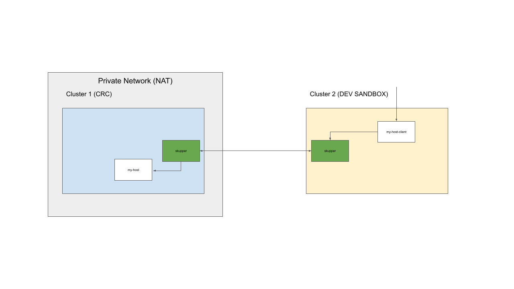

# Part 1 - Hybrid Cloud Setup

This demo script shows you how to deploy a front-end service running on one cluster that access a backend service running on a second cluster on a private network. The demo used the free service [OpenShift Developer Sandbox](https://developers.redhat.com/developer-sandbox) and Red Hat [OpenShift Local](https://developers.redhat.com/products/openshift-local/overview) (formerly Red Hat CodeReady Containers - referred to CRC in this demo script) deployed on your local network. The demo script should work with other clusters available to your desposal.

To run the demo script you need to have the skupper CLI installed as well as the OpenShift CLI. See the [Skupper Getting Started Guide](https://skupper.io/start/index.html) for info on how to install the Skupper CLI. Installation of the Skupper CLI is simple and the following snippet shows how to install the CLI on Linux/Mac:

        curl https://skupper.io/install.sh | sh

The following diagram describes the demo setup.

1. Open two terminals, set up the KUBECONFIG environment variable and log in to each OpenShift cluster.

    terminal1 (CRC):

        touch $HOME/.kube/crc

        export KUBECONFIG=$HOME/.kube/crc

        mkdir -p ~/temp/skupper

        cd  ~/temp/skupper

        PS1='[CRC] \W $ '; export PS1

        oc login <YOUR CRC URL AND CREDTIALS>

    terminal2 (SANDBOX):

        touch $HOME/.kube/sandbox

        export KUBECONFIG=$HOME/.kube/sandbox

        cd  ~/temp/skupper

        PS1='[SANDBOX] \W $ '; export PS1

        oc login <YOUR DEV SANDBOX URL AND CREDTIALS>

2. In the SANDBOX terminal:

        skupper init --site-name sandbox --enable-console=false

        skupper token create crc-to-sandbox-token.yaml

3. In the CRC terminal

        oc new-project skupper-demo

        skupper init --site-name crc --console-auth unsecured
        
        skupper link create --name crc-to-sandbox crc-to-sandbox-token.yaml

4. In the CRC terminal

        oc apply -f https://raw.githubusercontent.com/mostmark/skupper-demo/main/my-host-deployment-crc.yaml

        skupper service create my-host 8080 --protocol http

        skupper service bind my-host deployment my-host

5. In the SANDBOX terminal

        oc apply -f https://raw.githubusercontent.com/mostmark/skupper-demo/main/my-host-client-deployment.yaml

        oc apply -f https://raw.githubusercontent.com/mostmark/skupper-demo/main/my-host-client-service.yaml

        oc apply -f https://raw.githubusercontent.com/mostmark/skupper-demo/main/my-host-client-route.yaml

6. In the SANDBOX terminal. Get the route for the client application and show the web app. Notice how the front-end application renders the result of the api call to the backend service (my-host). The backend service should return the name of the pod servicing the request and the name of the cluster (CRC) the pod is running in. The name of the cluster is set by an environment variable in the deployment of the backend service.

        oc get route my-host-client

7. In the CRC terminal. Get the route for the Skupper Console and demonstrate the console.

        oc get route skupper

Continue to [Part2](./part2-resilience.md) where we will deploy both the frontend and the backend service in each cluster and show how Skupper can provide resiliency and loadbalincing
