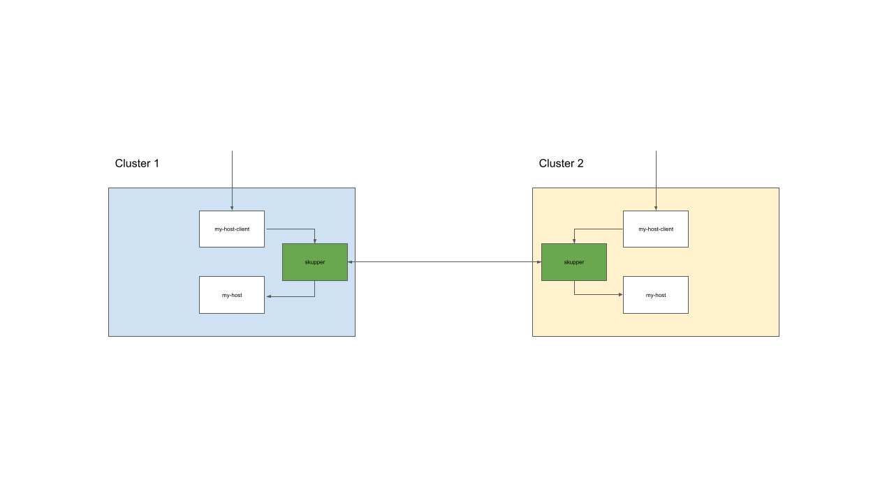

# Part 2 - Resilience

This demo script extends on [part 1](./part1-hybrid-cloud.md) and shows load balancing and resiliencecy capabilities in Skupper. In this example we are deploying two identical copies of the application used in [part 1](./part1-hybrid-cloud.md). The backend service is exposed on the Skupper network and Skupper loadbalances accross the two instances of the backend service but always use the local service when it is available. To simulate a failure of the local backend service you scale down the number of replicas to zero. Skupper will automaticlly detect this and start route requests to the instance in the second cluster. When the local service becomes available again Skupper will start routing trafic to the this instance.

The following diagram describes the setup.

1. In the SANDBOX terminal - deploy a second copy of the backend service and bind it to the my-host skupper service

        oc apply -f https://raw.githubusercontent.com/mostmark/skupper-demo/main/my-host-deployment-sandbox.yaml
        
        skupper service bind my-host deployment my-host

2. In the CRC terminal - deploy a local copy of the web app

        oc apply -f https://raw.githubusercontent.com/mostmark/skupper-demo/main/my-host-client-deployment.yaml

        oc apply -f https://raw.githubusercontent.com/mostmark/skupper-demo/main/my-host-client-service.yaml

        oc apply -f https://raw.githubusercontent.com/mostmark/skupper-demo/main/my-host-client-route.yaml

3. In the CRC terminal. Get the route for the client application and show the web app and how it is routing traffic to the local backend service.

        oc get route my-host-client

4. In the CRC terminal. Scale down the backend service to 0 and reload the web application. Requests for the backend service should now be served by the backend service running in the SANDBOX cluster.

        oc scale deployment/my-host --replicas=0

5. In the CRC terminal. Scale up the backend service to 2 and reload the web application. Requests for the backend service should now be served again by the backend service running in the CRC cluster. Also observe that since we scaled up to two instances the requests are load balanced accross the two pods serving the requests.

        oc scale deployment/my-host --replicas=2

6. Access the Skupper Console at the CRC cluster and show the updated topology.

        oc get route skupper
