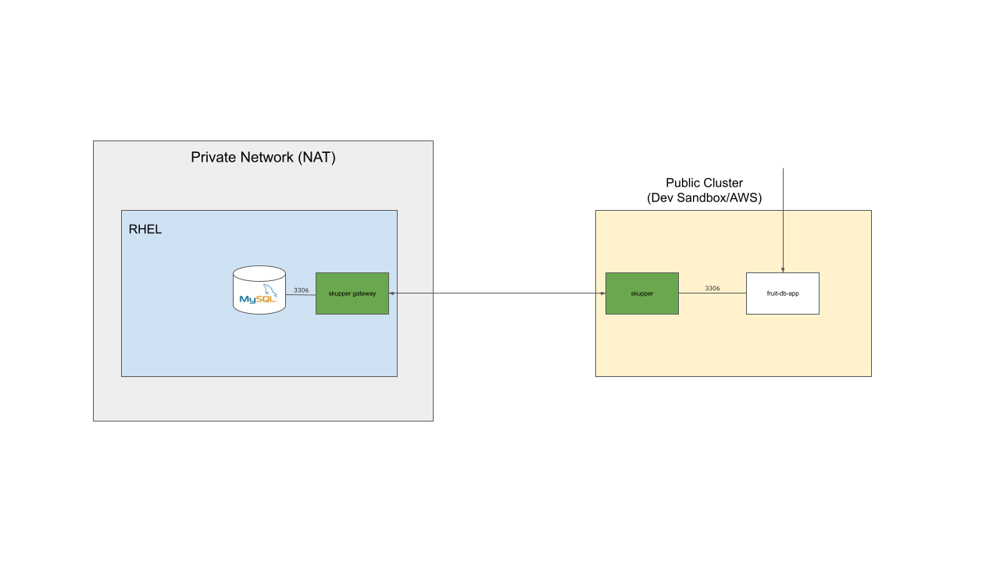

# Part 3 - Private Database Access

This demo script shows how to access a MySQL database running on an instance of RHEL in a private network. The demo uses the Skupper Gateway component to expose the database on the Skupper network. The demo uses the free service [OpenShift Developer Sandbox](https://developers.redhat.com/developer-sandbox) to run the web application that connects to the database.

The following diagram describes the setup.

The prerequisites to run the demo script is to install a MySQL on your RHEL instance and create the database, the user and finally assign the privledges for the user to use the database. The web application used in the demo will automatically create the table and insert sample data at startup. For more information on how to install RHEL please see this [section](https://access.redhat.com/documentation/en-us/red_hat_enterprise_linux/9/html/configuring_and_using_database_servers/assembly_using-mysql_configuring-and-using-database-servers) in the RHEL documentation.

Use the following snippet to create the database and user in the MySQL database:
        
        mysql -u root

        CREATE USER 'myuser'@'localhost' IDENTIFIED BY 'mypassword';
        CREATE USER 'myuser'@'%' IDENTIFIED BY 'mypassword';
        GRANT ALL PRIVILEGES ON fruitdb.* TO 'myuser'@'%';
        GRANT ALL PRIVILEGES ON fruitdb.* TO 'myuser'@'localhost';

1. Open two terminals, one for the RHEL instance and one for the SANDBOX cluster

    terminal1 (RHEL):
    
        ssh myuser@my-rhel-instance
        
        oc login <YOUR DEV SANDBOX URL AND CREDTIALS>

    terminal2 (SANDBOX):

        PS1='[SANDBOX] \W $ '; export PS1

        oc login <YOUR DEV SANDBOX URL AND CREDTIALS>

2. In the SANDBOX terminal

        skupper init --site-name sandbox

3. In the RHEL terminal

        skupper gateway init --type podman
        skupper service create mysql 3306
        skupper gateway bind mysql localhost 3306

4. In the SANDBOX terminal. There should now be a mysql service.

        oc get services

5. In the SANDBOX terminal

        oc new-app docker.io/mostmark/fruit-database
        oc expose service/fruit-database
        oc get routes

6. Open the web application and notice the rows displayed

7. In the RHEL terminal. Check the rows inserted in the table FruitEntity by the application.

        mysql -u myuser -pmypassword fruitdb --port 3306 --host localhost --execute "SELECT * FROM Fruit;"

8. In the web application - add a fruit and click save

9. In the RHEL terminal. Run the command again to check that the content of the table has been updated.

        mysql -u myuser -pmypassword fruitdb --port 3306 --host localhost --execute "SELECT * FROM Fruit;"

---

To clean up after the demo:

1. In the SANDBOX terminal

        skupper delete
        oc delete all --all

2. In the RHEL terminal

        skupper gateway delete
